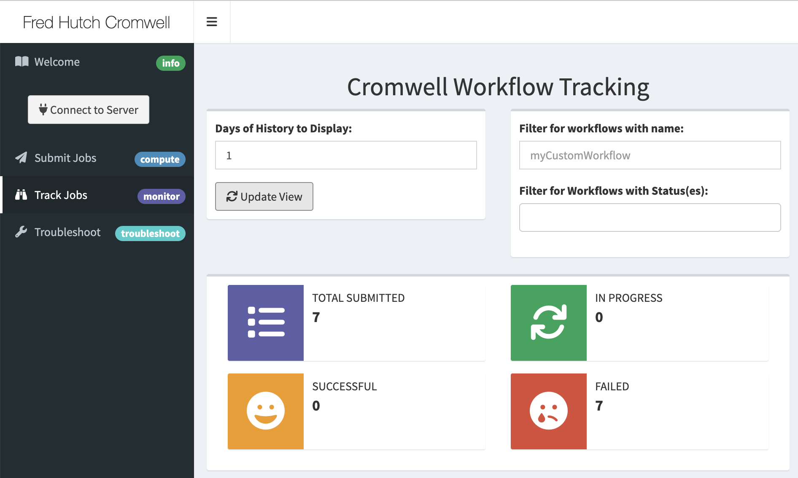
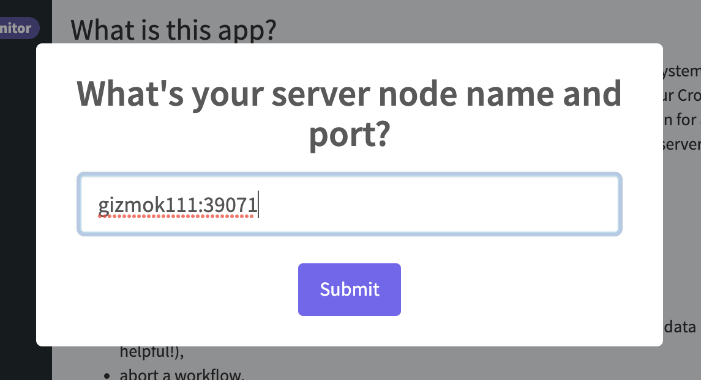
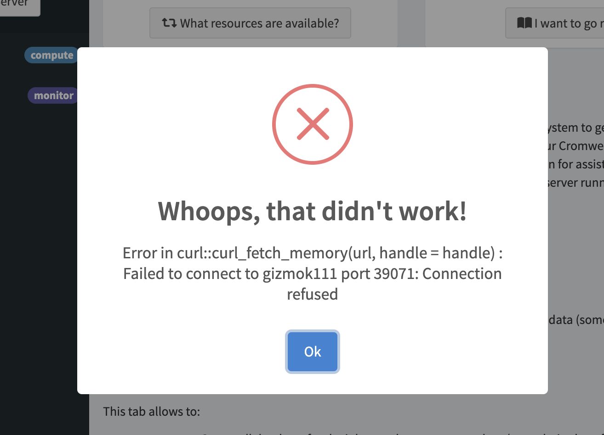
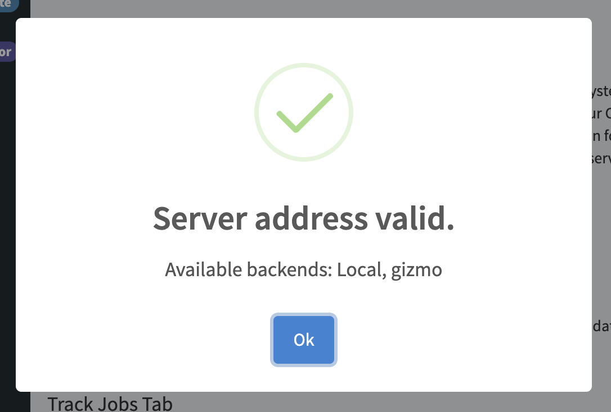

```{r, include = FALSE}
ottrpal::set_knitr_image_path()
```
# Using Shiny to Manage Workflows
Now that you've configured your first Cromwell sever, let's submit some test workflows to it using the Fred Hutch Shiny app! 

> Note: especially the first time you set up a Cromwell server, it will be busy for a few minutes setting up the database and doing all the work behind the scenes for you.  Once it's "ready" to listen for workflows it will start "listening" for instructions via the Shiny app (or other methods we'll discuss later in the course).   It may take 2-3 minutes before you can follow the rest of these instructions the first time. The time it takes is much shorter in the future (more like ~1 minute).


## Cromwell app
You can find our Fred Hutch Shiny app here:  https://cromwellapp.fredhutch.org/



This shiny app will let you use a graphic interface to submit and manage workflows you've written in WDL.  


### Login
While this Shiny app runs all the time, in order for it to know where to look for your particular information, you'll need to to "login" by clicking the "Connect to Server" button on the left.


When you click login, a box will appear where you will input your node:port combo from the output of the Cromwell server kickoff process before (it will be in the format of "gizmob5:39071"). 


If your server is not yet fully ready to listen for workflows you may see this error result:


If so, just wait 1-2 more minutes (if it's the first time you've set up a server, or less if it's a future instance) and try again.  Once the Shiny app can talk to your sever, you'll see this result screen:



### Run Test Workflows
We have curated a number of basic workflows that you can use to test to see if your Cromwell server is set up correctly and for you to test out how working with Cromwell is done. 
See our [Test Workflow folder](https://github.com/FredHutch/diy-cromwell-server/tree/main/testWorkflows) once your server is up and run through the tests specified in the markdown there. 
> NOTE: For those test workflows that use Docker containers, know that the first time you run them, you may notice that jobs aren't being sent very quickly.  That is because for our cluster, we need to convert those Docker containers to something that can be run by Singularity.  The first time a Docker container is used, it must be converted, but in the future Cromwell will used the cached version of the Docker container and jobs will be submitted more quickly. 


