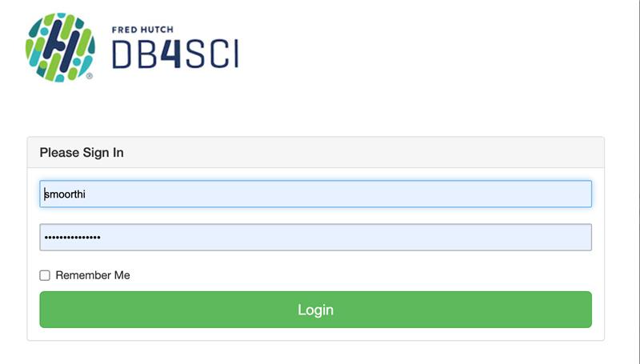
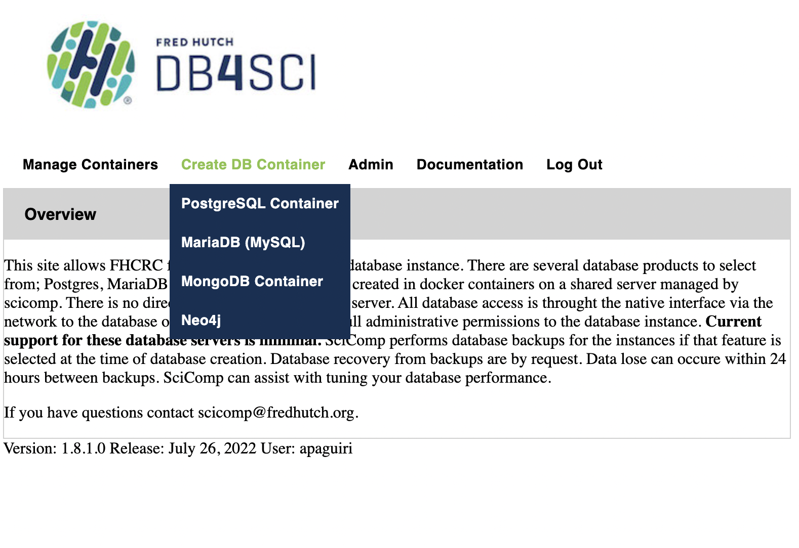
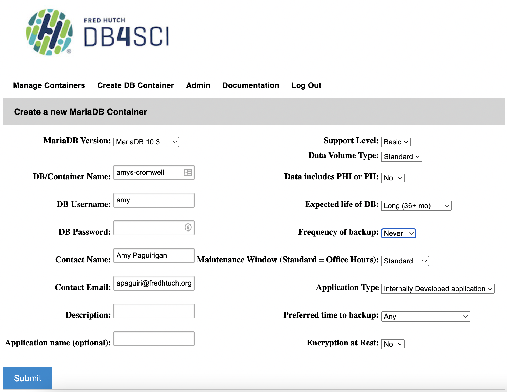

# Introduction

WDL is an open specification for a workflow description language that originated at the Broad but has grown to a much wider audience over time. WDL workflows can be run using an engine, which is software that interprets and runs your WDL on various high performance computing resources, such as SLURM (the Fred Hutch local cluster), AWS, Google and Azure.

At the Fred Hutch we have configured a software from the Broad called Cromwell to allow us to run WDLs on our local cluster that then can be easily ported to other cloud based compute infrastructure when desired. This allows us to simplify our workflow testing and design, leverage WDL for smaller scale work that does not need the cloud, and can let users of all kinds manage their workflow work over time via this tool.  

## What is Cromwell?
Cromwell is a workflow engine (sometimes called a workflow manager) software developed by the Broad which manages the individual tasks involved in multi-step workflows, tracks ob metadata, provides an API interface and allows users to manage multiple workflows simultaneously.  Cromwell isn't the only WDL "engine" that exists, but it is a tool that has been configured for use on the Fred Hutch gizmo cluster in order to make running workflows here very simple.


# Getting Started with Cromwell

To get set up using Cromwell at the Fred Hutch, there are two setup processes you need to do one time in order to customize how Cromwell runs for you.  

1.  Database Setup
2.  Cromwell customization

This guide aims to help you get these two steps set up correctly so that in the future you can just run Cromwell directly.  

## Prerequisites
### `rhino` Access
Either you need to have gotten access to use the Fred Hutch SLURM cluster prior OR have taken our "Cluster 101" course.  You can find this **free** course [here](https://leanpub.com/courses/fredhutch/fredhutchcluster101).
To follow this course, you'll need to know how to get onto the `rhino` nodes.  If this is not something you are familiar with, you also may want to read a bit more about the use of our cluster over at [SciWiki](https://sciwiki.fredhutch.org/) in the Scientific Computing section about Access Methods, and Technologies.

### (Optional) AWS Credentials
If you want to run workflows on data stored in AWS S3, you'll need to have set up your AWS credentials first.  
As of version 1.3 of the diy-cromwell-server configuration, if you have credentials, then the Cromwell server will be configured to allow input files to directly specified using their AWS S3 url.  
However if you do not have AWS credentials or aren't using data stored in AWS S3, then you don't have to do anything.  


## Database Setup
One of the strengths of using Cromwell is that it can allow you to keep track of what you've already done so you don't have to re-compute jobs that have already completed successfully even if some of your workflow fails.  To leverage this feature, called "call caching" and also use our computing resources efficiently, our configuration of Cromwell will help you set up a Cromwell server for 7 days at a time and creates a database that persists forever that the Cromwell servers can communicate with.  We have found that by using a MySQL database for your Cromwell server to store information in, it will run faster and be better able to handle simultaneous workflows while also making all the metadata available to you during and after the run.  


### Get Your Database Container
Thus for each user, we suggest setting up a database which only needs to be done one time per user using these steps:

1.  Go to [DB4Sci](https://mydb.fredhutch.org/login) and see the Wiki entry for DB4Sci [here](https://sciwiki.fredhutch.org/scicomputing/store_databases/#db4sci--previously-mydb).  
1.  Login using your Fred Hutch credentials

1.  Choose `Create DB Container`, and choose the MariaDB (MySQL) option.  

1.  Use the following:
    - Your DB Username can be whatever you want
    - Your DB Password should not be your Fred Hutch password
    - Provide a Contact name and your fredhutch.org email
    - Provide a Description (like "Cromwell database")
    - Set `Expected Life of DB`: Choose "Long (36+ mo)"
    - Set `Frequency of Backup`: "Never"

1.  Save the `DB/Container Name`, `DB Username` and `DB Password` somewhere handy as you will need them for the configuration step.  
1.  Click submit, a confirmation screen will appear (hopefully), and you'll need to note which `Port` is specified.  This is a 5 digit number currently.  Write this down!!!  If you have trouble with using DB4Sci, you can email `scicomp@fredhutch.org` and share the information or screen shots of what failed to get help.  

>Note:  If you do not see this screen, you can go to the `Manage Containers` tab in the MyDB interface and scroll down for your container name, and you can look in the `Port` column. 

At this point you should have a sticky note or something handy where you've put the DB Name, DB Username, DB Password and Port ready for the next steps. 

### Make Your Empty Database
Now you have a "container" in which to run a database, but the database itself does not yet exist.  
You need to create an empty database in that container and then Cromwell will do the rest the first time you start up a server. 

To create the database, you'll need to go to Terminal and connect to `rhino` then enter the following (where you replace the entire `<Port>` including the < and > with the text, for example, `34567`).

```
ml MariaDB/10.5.1-foss-2019b
mysql --host mydb --port <Port> --user <username> --password
```

It will then prompt you to enter the DB password you specified during setup.  Once you are are a "mysql>" prompt, you can do the following.

> Note, we suggest you name the database inside the container the same as the container, but you cannot include dashes in your database name.

```
MariaDB [(none)]> create database <DB Name>;
## It should do its magic - if it works it says:
#Query OK, 1 row affected
MariaDB [(none)]> exit
#Bye
```

Now you're ready to go and never have to set up the database part again and you can use this database to manage all your work over time!

## Start up your first Cromwell server

Now that you've set up your database so it's ready for Cromwell to talk to it and save your workflow information to it, you will customize Cromwell to work how you want it to work and you'll be ready to use it!

### Customize Your Configuration
To start up your first Cromwell server job, you first need to decide where you want to keep your Cromwell configuration files.  This must be a place where `rhino` can access them, such as in your `Home` directory, which is typically the default directory when you connect to the `rhinos`.  We suggest you create a `cromwell-home` folder (or whatever you want to call it) and follow these git instructions to clone it directly.

Then you will set up the customizations that you're going to want for your server(s) by making user configuration file(s) in your `cromwell-home` or wherever you find convenient.  

You can manage multiple Cromwell profiles this way by just maintaining different files full of credentials and configuration variables that you want.  

To get started, do the following on `rhino`:
```
mkdir -p cromwell-home
cd cromwell-home
git clone --branch main https://github.com/FredHutch/diy-cromwell-server.git
```

This will look like this:


Next you'll want to move the cromUserConfig.txt template file you just downloaded into your main `cromwell-home` directory for customization and keeping in the future. 


```
cp ./diy-cromwell-server/cromUserConfig.txt .
## When you are first setting up Cromwell, you'll need to put all of your User Customizations into this `cromUserConfig.txt` which can serve as a template.  
## After you've done this once, you just need to keep the path to the file(s) handy for the future.  
```

In `cromUserConfig.txt` there are some variables that allow users to share a similar configuration file but tailor the particular behavior of their Cromwell server to best suit them.  
The following text is also in this repo but these are the customizations you'll need to decide on for your server.
```
################## WORKING DIRECTORY AND PATH CUSTOMIZATIONS ###################
## Where do you want the working directory to be for Cromwell (note: this process will create a subdirectory here called "cromwell-executions")?  
### Suggestion: /fh/scratch/delete90/pilastname_f/username/
SCRATCHDIR=/fh/scratch/delete90/...

## Where do you want logs about individual workflows (not jobs) to be written?
## Note: this is a default for the server and can be overwritten for a given workflow in workflow-options.
### Suggestion: /fh/fast/pilastname_f/cromwell/workflow-logs
WORKFLOWLOGDIR=~/cromwell-home/workflow-logs

## Where do you want to save Cromwell server logs for troubleshooting Cromwell itself?
### Suggestion: ~/cromwell-home/server-logs
SERVERLOGDIR=~/cromwell-home/server-logs

################ DATABASE CUSTOMIZATIONS #################
## DB4Sci MariaDB details (remove < and >, and use unquoted text):

CROMWELLDBPORT=...
CROMWELLDBNAME=...
CROMWELLDBUSERNAME=...
CROMWELLDBPASSWORD=...

## Number of cores for your Cromwell server itself - usually 4 is sufficient.  
###Increase if you want to run many, complex workflows simultaneously or notice your server is slowing down.
NCORES=4

## Length of time you want the server to run for.  
### Note: when servers go down, all jobs they'd sent will continue.  When you start up a server the next time
### using the same database, the new server will pick up whereever the previous workflows left off.  "7-0" is 7 days, zero hours.
SERVERTIME="7-0" 
```


> Note:  For this server, you will want multiple cores to allow it to multi-task.  Memory is less important when you use an external database.  If you notice issues, the particular resource request for the server job itself might be a good place to start adjusting, in conjunction with some guidance from SciComp or the Slack [Question and Answer channel](https://fhbig.slack.com/archives/CD3HGJHJT) folks.

### Kick off your Cromwell server

Now that you've configured your future Cromwell servers, you can kick off your first Cromwell server job.  Go to `rhino` to your "cromwell-home" and do the following:
```
## You'll want to put `cromwell.sh` somewhere handy for future use, we suggest:
cp ./diy-cromwell-server/cromwell.sh .

## Then you'll want to make the script "executable":
chmod +x cromwell.sh

# Then simply start up Cromwell by executing the script and passing it the path to your configuration file. 
./cromwell.sh cromUserConfig.txt
```


Much like the `grabnode` command you may have used previously, the script will run and print back to the console instructions once the resources have been provisioned for the server. You should see something like this:


```
Your configuration details have been found...
Getting an updated copy of Cromwell configs from GitHub...
Setting up all required directories...
Detecting existence of AWS credentials...
Credentials found, setting appropriate configuration...
Requesting resources from SLURM for your server...
Submitted batch job 2733799
Your Cromwell server is attempting to start up on **node/port gizmok30:****.  If you encounter errors, you may want to check your server logs at /home/username/cromwell-home/server-logs to see if Cromwell was unable to start up.
Go have fun now.
```
> NOTE:  Please write down the node and port it specifies here.  This is the only place where you will be able to find the particular node/port for this instance of your Cromwell server, and you'll need that to be able to send jobs to the Cromwell server.  If you forget it, `scancel` the Cromwell server job and start a new one.  


While your server will normally stop after 7 days (the default), at which point if you have jobs still running you can simply restart your server and it will reconnect to existing jobs/workflows.  However, if you need to take down your server for whatever reason before that point, you can go to `rhino` and do:

```
## Here `username` is your Fred Hutch username
squeue -u username
## Or if you want to get fancy:
squeue -o '%.18i %.9P %j %.8T %.10M %.9l %.6C %R' -u username
```

You'll see a jobname "cromwellServer".  Next to that will be a JOBID. In this example the JOBID of the server is 2733799.


If you ever want to shut down your server before the 7 day default run time, you can always go to Rhino in your Terminal and end the server by doing:

```
scancel 2733799

```

## Starting up your server in the future
Good news! The above instructions are a one time event. In the future, when you want to start up a Cromwell server to do some computing work, all you'll have to do is:
1. Get onto Rhino in Terminal
2. Change to the `cromwell-home` directory you made
3. Enter: `./cromwell.sh cromUserConfig.txt` and you're off to the races!


Congrats you've started your first Cromwell server!!  Now on to how to submit a WDL workflow to it.
