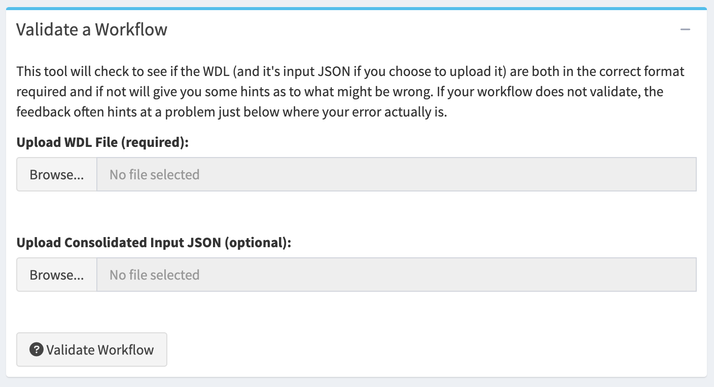
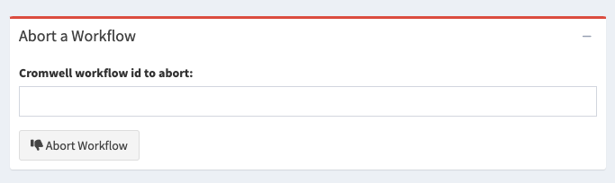
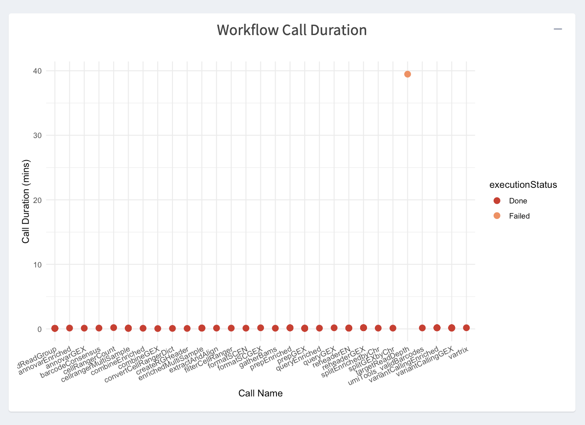

# Using Shiny to Manage Workflows
Now that you've configured your first Cromwell sever, let's submit some test workflows to it using the Fred Hutch Shiny app! 

>Note: Especially the first time you set up a Cromwell server, it will be busy for a few minutes setting up the database and doing all the work behind the scenes for you.  Once it's "ready" to listen for workflows it will start "listening" for instructions via the Shiny app (or other methods we'll discuss later in the course).   It may take 2-3 minutes before you can follow the rest of these instructions the first time. The time it takes is much shorter in the future (more like ~1 minute).

You can find our Fred Hutch Shiny app here:  https://cromwellapp.fredhutch.org/

This shiny app will let you use a graphic interface to submit and manage workflows you've written in WDL.  

## Login
While this Shiny app runs all the time, in order for it to know where to look for your particular information, you'll need to to "login" by clicking the "Connect to Server" button on the left.

When you click "Connect to Server", a box will appear where you will input the node:port combination you were assigned when you [started up your Cromwell server](https://hutchdatascience.org/FH_WDL101_Cromwell/getting-started-with-cromwell.html#kick-off-your-cromwell-server) (it will look something like this: `gizmob5:39071`). 

If your server is not ready to listen for workflows you may see this error:

If so, just wait 1-2 more minutes (if it's the first time you've set up a server, or less if it's a future instance) and try again.  Once the Shiny app can talk to your sever, you'll see this result screen:

## Submit Jobs Tab
Once you've connected your server to the Shiny app, you can start by using the "Submit Jobs" tab on the left.  

Here you'll see a series of sections that will allow you to do several things. In this guide we'll use a number of example workflows found in the `diy-cromwell-server` folder you just [cloned](https://hutchdatascience.org/FH_WDL101_Cromwell/getting-started-with-cromwell.html#customize-your-configuration) from [GitHub](https://github.com/FredHutch/diy-cromwell-server/tree/main/testWorkflows).

Each of these example workflows is in a folder containing a WDL file (specifying the workflow itself), and any input files that you'll need (in  JSON format).  There is [emerging documentation about the WDL specification itself being generated by the openWDL community here](https://wdl-docs.readthedocs.io/en/1.0.0/).  Also, there is some useful, though very detailed, information in the [openWDL GitHub repo for the specification itself where you can learn more](https://github.com/openwdl/wdl/blob/main/versions/development/SPEC.md#introduction). 

### Validate a workflow
This checks the format of your workflow files to make sure you have a valid file in a known format that Cromwell can interpret.  It does not perform a "dry run" or check to see if any of your inputs are actually available, only that it can interpret what you told it. 

### Submit a workflow
This will let you upload the files that contain your workflow description (a WDL), and up to two different sets of input lists (in JSON format).  You can run a workflow with no input JSON, one input JSON, or two input JSONs (which will be concatenated or the second will overwrite the first if the same variable is declared in both).  You can upload a workflow options JSON, as well as providing text labels of your choosing to workflows if you'd like.  

When you click that "Submit Workflow" button, you'll see confirmation in a new box that appears with the workflow submission ID and status. These IDs are long strings that look something like this: `4e7e244a-d6b1-41db-a324-45229ff34b00` and they're useful if, for example, you want to abort a workflow, or identify it in the "Track jobs" tab. This workflow id string is unique to an individual workflow run, so if you run the same workflow a second time, you'll get a different string. This means that this unique identifier string can be used to help understand the data source file(s) used to generate each set of results files, helping make your work reproducible.

### Abort a workflow
Sometimes you realize you want to kill a workflow.  Using the workflow submission id, you can kill specific workflows using this box.  Note it will take Cromwell some time to coordinate SLURM job cancellations, but it will clean everything up for you. 

### Troubleshoot a workflow
Especially in the beginning if you have catastrophic workflow failures and you can't even figure out what's going on, you can come back to this Troubleshoot box to retrieve the entire, unformatted JSON output of all metadata Cromwell has about your workflow.  You probably are better served by the "Track Jobs" tab for checking how your workflow is going, but if there's nothing there that's helpful, then this box is where you'll want to go.  
> Note: this output is not for the faint of heart, but it will give you hints once you get used to understanding what Cromwell is telling you.  

## Track Jobs Tab

Once you've submitted a workflow, you'll want to track how it's going in the Track Jobs tab. 

### History of workflows
At the top, you'll see that you can display as many days of workflow history as you'd like, filter that result for workflows with a specific name or with specific status(es) like 'failed', 'succeeded', etc. This can help if you have submitted a LOT of workflows and you don't want to see them all, or if the Cromwell server is still busy working through all of your submissions and recording their status.

Once you click "Update View", the revelant workflows will be returned and you'll see various information on those workflows.  

First, there's a "Workflows Run" plot, showing how long each workflow ran for, and status for each. 

Underneath, you'll see a "Cromwell Overview" table showing metadata for each workflow.  Click on the workflow you're interested in to populate the rest of the tables (below). 

### Diving into a Workflow
Once you've selected a workflow row, you'll see some summary information about that workflow.

You can see a plot of the timing and outcomes of all the calls in that workflow.

Then there is a table of each call containing useful information such as the directory where the job is working (callRoot), its SLURM job ID, what computing resources or software environment were used, and the job's status.  

Then you can use the Job Failures and Call Caching tables to retrieve information relevant to those processes by clicking the "Get/Refresh ... Metadata" buttons (sometimes these can be quite large, and thus they do not load until you want them).   

Finally, once a workflow succeeds, Cromwell can tell you (and this Shiny app can help you download) a table showing where to find the workflow outputs (note this is not every file created, only the ones you specify as "results" using the WDL file's 'workflow output' block).  This lets you find output files and interact with them, archive them, or otherwise copy them to longer term storage for use.  

## Run Test Workflows
Now that you know how to use the app, it's time to run a test workflow.  

We have curated some basic workflows that you can use to test whether your Cromwell server is set up correctly and to let you to play with Cromwell. Once your server is up, run through the examples in our [Test Workflow folder](https://github.com/FredHutch/diy-cromwell-server/tree/main/testWorkflows). 

> Note: For test workflows that use Docker containers, the first time you run them you may notice that jobs aren't being sent very quickly.  That is because for our cluster, we need to convert those Docker containers to something that can be run by Singularity.  The first time a Docker container is used, it must be converted, but in the future Cromwell will used the cached version of the Docker container and jobs will be submitted more quickly. 

